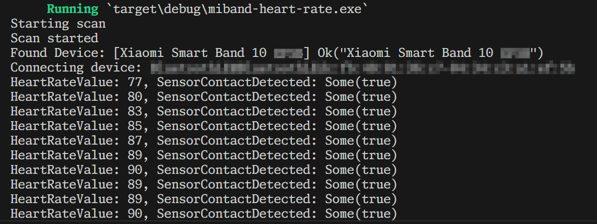

# MiBand Heart Rate Demo

> For miband 4~7, checkout `miband-4-to-7` tag
>
> 对于小米手环 4~7，请切换到 `miband-4-to-7` 标签

A Demo of reading "Shear heart rate data" of Xiaomi Smart Band 10. Enable the option in official App is required.

接收小米手环10 "运动心率广播" Demo，需在手环设置-心率广播中开启广播功能。

欢迎二次开发。

## Supported Platform

I use `bluest` crate. I copy its words below.

> Bluest is a cross-platform Bluetooth Low Energy (BLE) library for Rust. It currently supports Windows (version 10 and later), MacOS/iOS, and Linux. Android support is planned.

So it supported:

- Windows 10/11
- MacOS/iOS
- Linux

## Supported MiBands

MiBand 10 小米手环 10

Tested on MiBand10/NFC.

## Screenshot



## Python version

This project also includes a Python version implemented with `bleak` library. To run the Python version:

1. Install required dependencies:
   ```bash
   pip install -r requirements.txt
   ```
   or directly install bleak:
   ```bash
   pip install bleak
   ```

2. Run the Python script:
   ```bash
   python miband_heart_rate.py
   ```

The Python version provides the same functionality as the Rust version but with broader compatibility and easier setup.